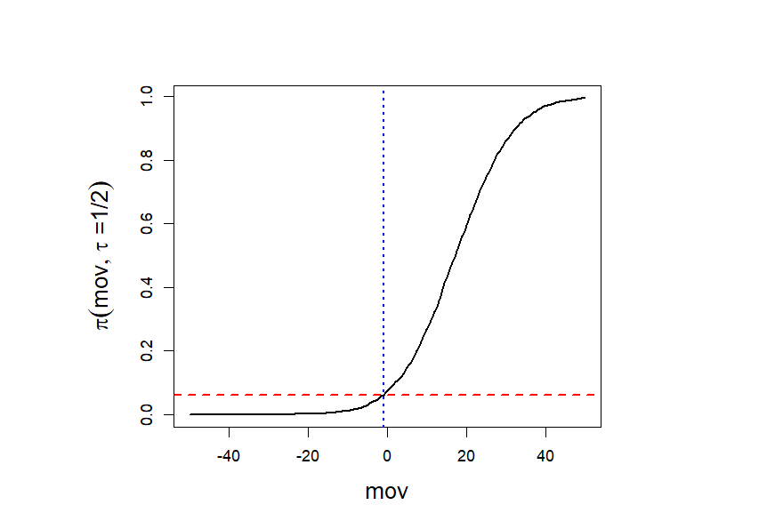

Conformal Win Probabability for NCAA Basketball
================
Chancellor Johnstone and Dan Nettleton

<!-- README.md is generated from README.Rmd. Please edit that file -->

## Introduction

This repository holds all data and code for \`\`Using Conformal Win
Probability to Predict the Winners of the Cancelled 2020 NCAA Basketball
Tournaments", which uses conformal predictive distributions to estimate
win probabilities for NCAA Division 1 women’s (and men’s) basketball. We
also implement a simplified closed-form approach to generate
probabilities of making the NCAA tournament (March Madness). To utilize
the code and data available, clone this repository.

## Workflow

The workflow for the results in the paper can be broken down into three
main thrusts: 1) data cleaning, 2) win probability generation and 3)
calibration. We describe this workflow and associated code in the
following section.

### Data Cleaning

The data cleaning portion of the workflow consisted of different
approaches for the men’s and women’s data. The men’s data was freely and
easily accessible from:

<https://www.sportsbookreviewsonline.com/scoresoddsarchives/ncaabasketball/ncaabasketballoddsarchives.htm>

The women’s data, unavailable in any easy format, was collected through
a lengthy scraping process from:

<https://www.ncaa.com/scoreboard/basketball-women/d1/>

All scraping was performed using
[ncaaw\_scrape.R](https://github.com/chancejohnstone/SportsPIs/blob/master/ncaaw_scrape.R).
You can scrape all scores from the 2014-2015 season all the way to the
2020-2021 season with:

``` r
source("ncaaw_scrape.R")
```

The entirety of the data is saved as
[ncaaw\_2014\_2021\_data\_fix.csv](https://github.com/chancejohnstone/SportsPIs/blob/master/ncaaw_2014_2020_data_fix.csv).
In reality, the men’s data could be scraped in a similar fashion. We
chose to utilize the freely available data for the men’s analysis
regardless. We then “clean” the two datasets, to get the data in a
fashion conducive to performing our analysis with:

``` r
source("clean_ncaaw.R")
source("clean_ncaab.R")
```

The cleaned data is saved as
[clean\_ncaaw\_scores\_2014\_2020\_all.csv](https://github.com/chancejohnstone/SportsPIs/blob/master/clean_ncaaw_scores_2014_2020_all.csv)
and
[clean\_ncaam\_scores\_2014\_2020\_all.csv](https://github.com/chancejohnstone/SportsPIs/blob/master/clean_ncaab_scores_2014_2020_all.csv)
for the women and men, respectively.

One issue with both the men’s and women’s data is that naming convention
is (extremely) inconsistent for each team across both the men’s and
women’s datasets. For example, North Carolina A&T appears in seven
different forms across the two datasets, e.g., NCA&T, NCarolinaAT, NCAT.
To remedy this, we select one name for each school as “correct,” then
replace any occurrence of a team with the correct name in the
\`\`cleaned" datasets. The correct team names are saved in
[ncaa\_clean\_names\_list.csv](https://github.com/chancejohnstone/SportsPIs/blob/master/ncaa_clean_names_list.csv).
The name cleaning is crucial to getting correct estimates for each
team’s strength; otherwise there would be teams with only one or two
games in the dataset.

### Win Probability Generation

In order to provide a case study for the 2019-2020 season, we needed to
generate conference win probabilities starting from when each conference
tournament was cancelled. The conference tournament schedules as they
were prior to cancellation for the women and men are shown in
[conf\_tournament\_schedule.csv](https://github.com/chancejohnstone/SportsPIs/blob/master/conf_tournament_schedulew.csv)
and
[conf\_tournament\_schedulew.csv](https://github.com/chancejohnstone/SportsPIs/blob/master/conf_tournament_schedule.csv),
respectively. Careful consideration was taken to account for byes within
each conference tournament. Conference win probability estimates for
both women and men were generated using
[make\_tourn\_probs\_conformal.R](https://github.com/chancejohnstone/SportsPIs/blob/master/make_tourn_probs_conformal.R).
Conference win probabilities for the women and men are saved in
[conf\_wp\_w\_conf.csv](https://github.com/chancejohnstone/SportsPIs/blob/master/conf_wp_w_conf.csv)
and
[conf\_wp\_m\_conf.csv](https://github.com/chancejohnstone/SportsPIs/blob/master/conf_wp_m_conf.csv),
respectively. The conformal win probabilities are generated within this
R function, but win probabilities for the linear and logistic approaches
are generated using separate R files:

[all\_year\_ranks\_test\_ncaa\_both.R](https://github.com/chancejohnstone/SportsPIs/blob/master/all_year_ranks_test_ncaa_both.R)

[all\_wp\_prep\_seasons\_fresh.R](https://github.com/chancejohnstone/SportsPIs/blob/master/all_wp_prep_seasons_fresh.R)

The first R file generates models for each season along with training
and test datasets in specific formats. The second file generates
conference win probabilities for each of the two aforementioned methods.

### Calibration

Once the previous workflow steps are complete, the calibration results
for the paper were generated with

``` r
source("calibrate_ncaa_all.R")
```

### March Madness Probabilities

In addition to conformal win probabilities, in the paper we also
introduce a closed-form approach to generate probabilities for teams
making the March Madness tournament field, under a simplified selection
process. The probabilities of making the tournament for teams in
situations 2 and 3 can be reconstructed with

``` r
source("make_tourn_probs_conformal.R")
```

The March Madness field probabilities for teams in situation 4, who can
only make the March Madness field by winning their conference
tournament, have been generated in previous sections.

March Madness win probabilities for each exemplar brackets described in
the paper can be generated with

``` r
source("bracket_exemplars_conformal.R")
```

## Conformal Predictive Distribution Example

In the paper we construct the conformal predictive distribution for the
margin of victory between Baylor and Oregon State using data from the
2019-2020 regular season. We reproduce the example below:



To generate additional CPD for different games, one can utilize the
*generate\_cpd()* function within
[generate\_cpd\_ncaa.R](https://github.com/chancejohnstone/SportsPIs/blob/master/generate_cpd_ncaa.R).
An example of the function in use is shown below, with CPDs generated
for Baylor against South Carolina and Connecticut:

``` r
source("generate_cpd_ncaa.R")
#> 
#> Attaching package: 'dplyr'
#> The following objects are masked from 'package:stats':
#> 
#>     filter, lag
#> The following objects are masked from 'package:base':
#> 
#>     intersect, setdiff, setequal, union
#> Warning: package 'ggplot2' was built under R version 4.0.4
#> Warning: package 'Iso' was built under R version 4.0.3
#> Iso 0.0-18.1
#> Warning: package 'doParallel' was built under R version 4.0.2
#> Loading required package: foreach
#> Loading required package: iterators
#> Loading required package: parallel

num_games <- 2
year_vec <- rep(2019, times = num_games)
league_vec <- rep("w", times = num_games)
home_team_vec <- rep("Baylor", times = num_games)
away_team_vec <- c("SouthCarolina", "Connecticut")
cpd_Baylor <- generate_cpd(year_vec, league_vec, home_team_vec, away_team_vec)

y_cand <- seq(-50,50,length.out = 201)
w <- 4
h <- 3
par(pin=c(w, h))
plot(y = cpd_Baylor$cpd[,1], x = y_cand, type = "l", lwd = 2, 
     ylab = expression(pi(mov,tau~"=1/2")), xlab = "mov", cex.lab = 1.5)
lines(y = cpd_Baylor$cpd[,2], x = y_cand, lwd = 2, col = "red", lty = 2)
abline(v = -1, col = "blue", lty = 3, lwd = 2)
legend("topleft", legend = c("South Carolina", "Connecticut"),
                             col = c("black", "red"), lwd = 2, lty = c(1,2))
```


## References

<div id="refs" class="references csl-bib-body hanging-indent">

<div id="ref-johnstone2020topics" class="csl-entry">

Johnstone, Chancellor. 2020. “Shape-Restricted Random Forests and
Semiparametric Prediction Intervals.” PhD thesis, Iowa State University.

</div>

<div id="ref-johnstone2022ncaa_cpd" class="csl-entry">

Johnstone, Chancellor, and Dan Nettleton. "Using Conformal Win Probability to Predict the Winners of the Canceled 2020 NCAA Basketball Tournaments." The American Statistician (2023): 1-14.
<https://www.tandfonline.com/doi/full/10.1080/00031305.2023.2283199>

</div>

<div id="ref-vovk2019nonparametric" class="csl-entry">

Vovk, Vladimir, Jieli Shen, Valery Manokhin, and Min-ge Xie. 2019.
“Nonparametric Predictive Distributions Based on Conformal Prediction.”
*Machine Learning* 108 (3): 445–74.

</div>

</div>
